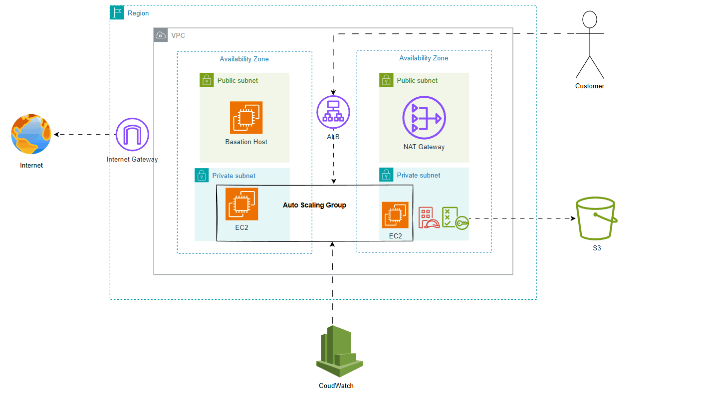

# Scalable Cloud AWS Infrastructure with Terraform
This project demonstrates the design and automation of a scalable, secure AWS infrastructure using Terraform. It showcases best practices in cloud architecture, automation, and resource management.

### Objectives:
- To design a robust and scalable cloud infrastructure on AWS.
- To automate infrastructure provisioning using Terraform.
- To ensure high availability and fault tolerance.
- To integrate secure file storage and application monitoring.
## Architecture Diagram

## Key Features and Services
### 1. Amazon VPC (Virtual Private Cloud)
**Purpose:** To isolate and secure the infrastructure within a dedicated network.  
**Features:**
- Configured a custom VPC with:
-   Public Subnets: For hosting the NAT Gateway and Elastic Load Balancer.
-   Private Subnets: For hosting application EC2 instances.
- NAT Gateway: Allowed instances in private subnets to access the internetsecurely.
- Route Tables: Configured for proper routing between subnets and internet-bound traffic.

### 2. Amazon EC2 (Elastic Compute Cloud)
**Purpose:** Provided scalable and customizable compute resources for hosting theapplication.  
**Features:** 
- Bastion Host: Deployed in the public subnet for secure SSH access to privateinstances.
- Application Instances: Hosted in private subnets, configured to run PHP andApache to serve the web application.
- User Data Scripts: Automated the installation of software (Apache, PHP, AWS CLI) and configuration of the web server.

### 3. Elastic Load Balancer (ALB)
**Purpose:** Distributed incoming traffic across multiple EC2 instances for high availability.  
**Features:** 
- Application Load Balancer deployed in public subnets.
- Health Checks: Ensured only healthy instances served traffic.
- DNS-based access for seamless user experience.

### 4. Auto Scaling Group
**Purpose:** Ensured application availability and scalability during varying loads.  
**Features:** 
- Configured desired, minimum, and maximum capacity for EC2 instances.
- Integrated with the Launch Template to spin up instances automatically.
- Propagated Name tags to dynamically launched instances.

### 5. Amazon S3 (Simple Storage Service)
**Purpose:** Provided a reliable and scalable storage solution for user-uploaded files.  
**Features:** 
- File Uploads: Integrated with the PHP application to store files in the S3 bucket.
- Enabled fine-grained access control using IAM roles and bucket policies.
- Organized files under structured prefixes (e.g., uploads/).

### 6. IAM (Identity and Access Management)
**Purpose:** Managed secure access to AWS services and resources.  
**Features:** 
- IAM Role attached to EC2 instances to allow S3 access.
- Policies granting s3:PutObject and s3:GetObject permissions.
- Ensured security by eliminating hardcoded credentials in the application.

### 7. CloudWatch
**Purpose:** Monitored the infrastructure for performance and troubleshooting.  
**Features:** 
- Logs: Monitored Apache access and error logs for debugging.
- Metrics: Tracked CPU utilization, memory usage, and instance health.
- Alarms: Configured alerts to notify on thresholds like high CPU usage.

## Impact and Skills Demonstrated:
This project deepened my expertise in AWS services (VPC, EC2, S3, ELB, IAM, CloudWatch) and taught me professional infrastructure management with Terraform. I am confident in my ability to design and deploy scalable, secure, and efficient cloud solutions tailored to business needs.

## Gratitude and Reflection
I am deeply grateful for the opportunity to build this project, which not only strengthened my understanding of AWS services but also introduced me to professional infrastructure management using Terraform. Learning and implementing these tools have significantly enhanced my skills and confidence in designing scalable and secure cloud solutions.

  
## Video Implementation

[View Video on Google Drive] (https://drive.google.com/drive/folders/1Rbuu36csvQOkPTaqE9ePmxD5Y6MhoK29?usp=drive_link)
